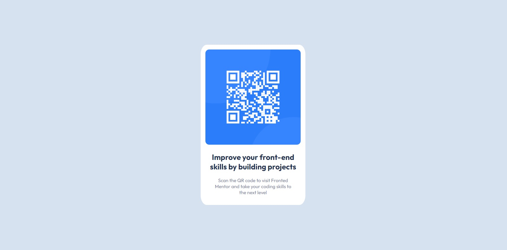

# Frontend Mentor - QR code component solution

This is a solution to the [QR code component challenge on Frontend Mentor](https://www.frontendmentor.io/challenges/qr-code-component-iux_sIO_H). Frontend Mentor challenges help you improve your coding skills by building realistic projects. 

## Table of contents

- [Overview](#overview)
  - [Screenshot](#screenshot)
  - [Links](#links)
- [My process](#my-process)
  - [Built with](#built-with)
  - [What I learned](#what-i-learned)
  - [Continued development](#continued-development)
- [Author](#author)

## Overview

### Screenshot



### Links

- Solution URL: [QR code component repo](https://github.com/camilo300792/camilo300792.github.io/tree/main/qr-code-component)
- Live Site URL: [QR code component](https://camilo300792.github.io/qr-code-component/index.html)

## My process

For build this challenge I learn about flexbox and grid displays.

### Built with

- Semantic HTML5 markup
- CSS custom properties
- Grid
- Flexbox (Initial version)

### What I learned

Item center with CSS grid and flexbox

```css
/* CSS grid */
.container {
  display: grid;
  place-items: center:
}
/* Flexbox */
.container {
  display: flex;
  justify-content: center;
  align-items: center;
}
```

### Continued development

I want to learn about CSS media queries and mobile first design.

## Author

- Github - [Camilo Martinez](https://github.com/camilo300792)
- Frontend Mentor - [@yourusername](https://www.frontendmentor.io/profile/camilo300792)